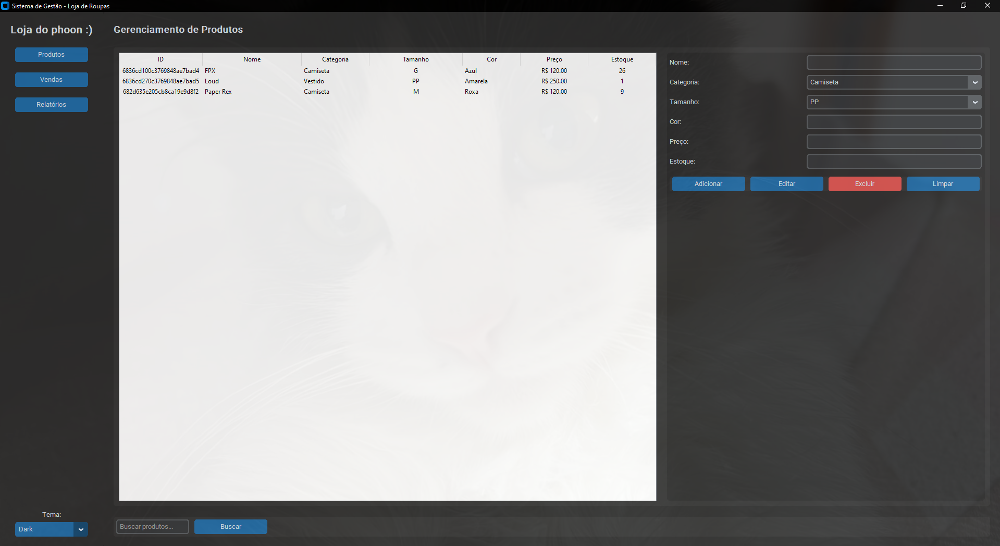
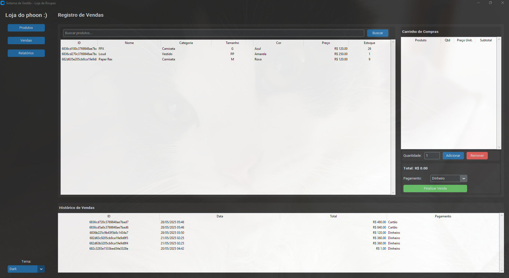
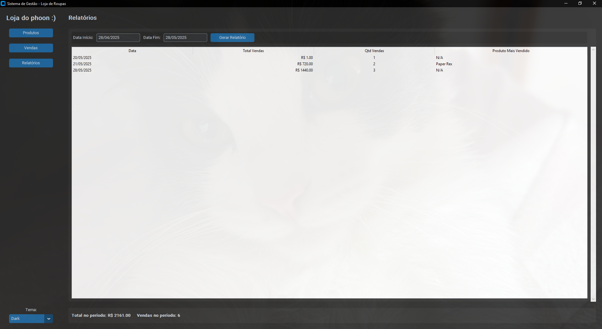

# 🛍️ Sistema de Gestão para Loja de Roupas

Este é um sistema completo de **gestão comercial** para lojas de roupas, desenvolvido com **Python**, **CustomTkinter** e **MongoDB**. Ele permite o **controle de estoque, registro de vendas e geração de relatórios financeiros**, através de uma interface gráfica moderna e intuitiva.

---

## ✨ Funcionalidades

### 🛍️ Gestão de Produtos
- Cadastro, edição e exclusão de produtos.
- Visualização de estoque em tabela com busca dinâmica.
- Armazenamento das informações no banco de dados MongoDB.

### 💸 Controle de Vendas
- Adição de produtos a um carrinho de compras.
- Controle de quantidade e atualização automática do estoque.
- Registro de vendas com múltiplos métodos de pagamento: Dinheiro, Cartão e Pix.
- Visualização de histórico de vendas recentes.

### 📊 Geração de Relatórios
- Relatórios de vendas por período.
- Informações como:
  - Total de vendas.
  - Quantidade de vendas.
  - Produto mais vendido.
- Relatório automático dos últimos 30 dias.

### 🎨 Interface Gráfica Moderna
- Interface com tema escuro, claro ou automático.
- Layout responsivo com menu lateral de navegação.
- Desenvolvido com **CustomTkinter**.

---

## 🛠️ Tecnologias Utilizadas
- **Python 3.x**
- **CustomTkinter** → Interface gráfica moderna.
- **MongoDB** → Banco de dados NoSQL.
- **Tkinter** → Widgets e componentes gráficos.
- **bson** → Manipulação de ObjectId.

---

## 🗂️ Estrutura do Projeto

```text 
loja_de_roupas/
├── app.py # Arquivo principal para iniciar o sistema
├── config.py # Configuração do banco de dados e tema
├── ui/
│ ├── __init__.py # Inicializador do pacote ui
│ ├── base.py # Estrutura principal da aplicação
│ ├── produtos_frame.py # Gestão de produtos
│ ├── vendas_frame.py # Controle de vendas
│ └── relatorios_frame.py # Relatórios financeiros
├── images/
│ ├── UML.png # Diagrama UML
│ ├── Relatórios.png # Print da tela de relatórios
│ ├── Registro.png # Print da tela de registro de vendas
│ ├── Gerenciamento.png # Print da tela de gerenciamento
└── README.md # Documentação do projeto
```

---

## ⚙️ Pré-requisitos

- **Python 3.x** instalado.
- **MongoDB** rodando localmente (`mongodb://localhost:27017/`).

### 📦 Instalação de dependências:

```bash
pip install customtkinter pymongo
```

## 📸 Capturas de Tela

Registro de Estoque

Tela de venda

Relatórios financeiros


---

## 📝 Licença
Este projeto está sob a licença MIT. Sinta-se livre para usar e modificar.

# 👤 Autor
Desenvolvido por [phoon](github.com/phoonsz).
